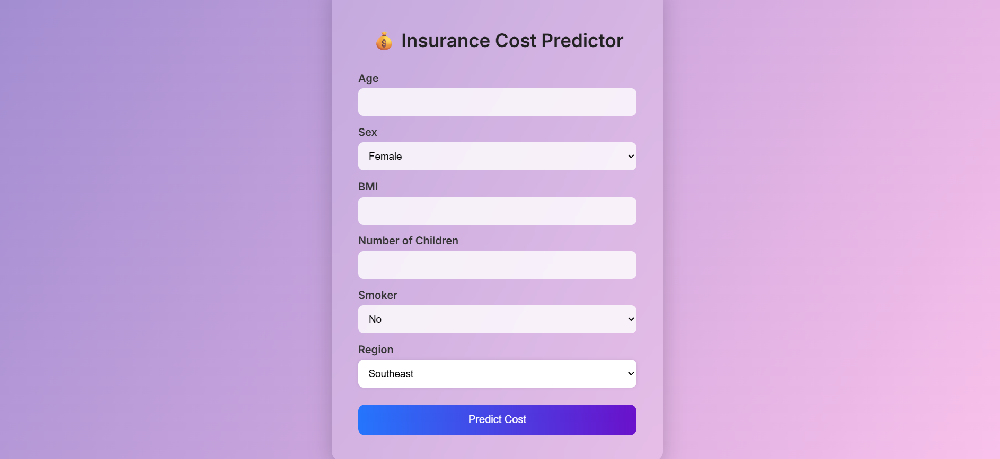

# 💰 Insurance Cost Prediction Web App

A modern and responsive machine learning web application that predicts **medical insurance charges** based on user input. Built using **Flask**, **Random Forest Regressor**, and styled with a clean, modern UI.



---

## 🚀 Features

- 💡 Predicts medical insurance costs from personal health and lifestyle data
- 🧠 Machine Learning model (Random Forest Regressor)
- 🎨 Clean, modern, responsive UI with emoji-enhanced form inputs
- 📦 Model saved using `joblib`
- ⚙️ Label encoding + feature scaling for better accuracy
- 💬 Shows predicted insurance cost in popup
- 📈 Accuracy: Train R² ~ 97.7%, Test R² ~ 83.5%
- 🖥️ Works on desktop and mobile
- ❤️ Footer attribution included

---

## 📁 Project Structure

insurance-predictor/
│
├── static/
│ └── style.css # Custom styling
│
├── templates/
│ └── index.html # Frontend form
│
├── insurance_model.joblib # Trained ML model
├── insurance.csv # Dataset
├── app.py # Flask backend
├── requirements.txt # Dependencies
├── preview.png # App screenshot
└── README.md # You're here!


---

## 📊 Dataset Info

- **Source**: [Kaggle - Medical Cost Personal Dataset](https://www.kaggle.com/datasets/mirichoi0218/insurance)
- **Features**:
  - 👴 Age
  - 🧑‍⚕️ Sex
  - ⚖️ BMI
  - 👶 Children
  - 🚬 Smoker
  - 🌎 Region (southeast, southwest, northeast, northwest)
  - 💵 Charges (Target Variable)

---

## 🧠 Model Training

```python
from sklearn.ensemble import RandomForestRegressor
from sklearn.preprocessing import LabelEncoder
from sklearn.model_selection import train_test_split
import pandas as pd
import joblib

# Load and encode data
df = pd.read_csv("insurance.csv")
le = LabelEncoder()
df['sex'] = le.fit_transform(df['sex'])
df['smoker'] = le.fit_transform(df['smoker'])
df['region'] = le.fit_transform(df['region'])

# Train-test split
x = df.drop(columns='charges')
y = df['charges']
x_train, x_test, y_train, y_test = train_test_split(x, y, test_size=0.2, random_state=42)

# Train model
model = RandomForestRegressor()
model.fit(x_train, y_train)

# Save model
joblib.dump(model, 'insurance_model.joblib')

----------
🖥️ How to Run Locally
1️⃣ Clone the Repo

git clone https://github.com/<your-username>/insurance-predictor.git
cd insurance-predictor

2️⃣ Create a Virtual Environment

python -m venv venv
source venv/bin/activate    # macOS/Linux
venv\Scripts\activate       # Windows

3️⃣ Install Dependencies

pip install -r requirements.txt

4️⃣ Run the App

python app.py
Then go to http://127.0.0.1:5000 in your browser.
-------
📦 Requirements

flask
numpy
pandas
scikit-learn
joblib

Or install manually:

pip install flask numpy pandas scikit-learn joblib

🙌 Contributing
Pull requests are welcome! If you'd like to improve the UI or add new models, feel free to fork and submit a PR.

📄 License
This project is licensed under the MIT License.

👨‍💻 Created with ❤️ by Adarsh Paswan


---


